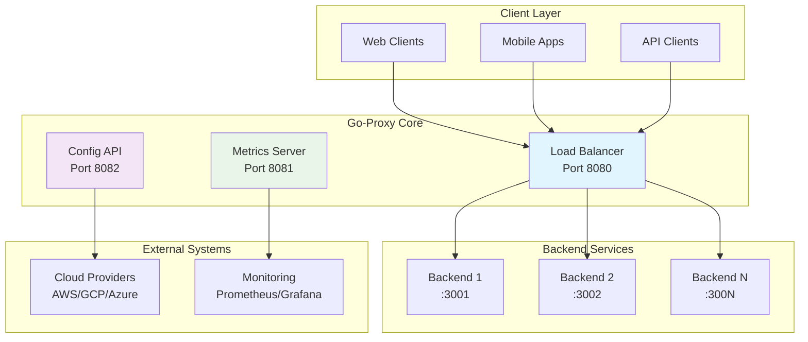
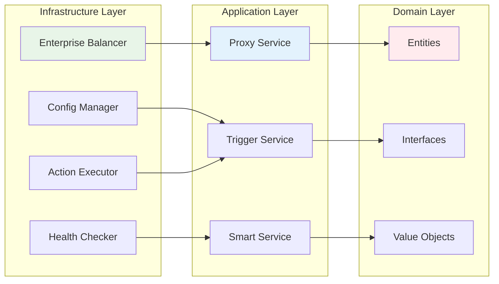
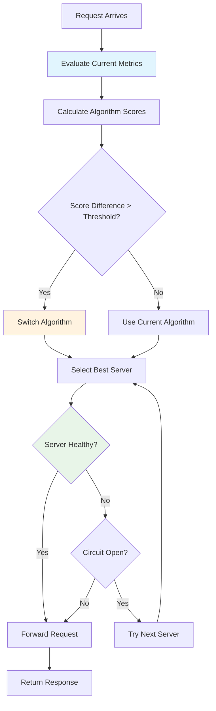
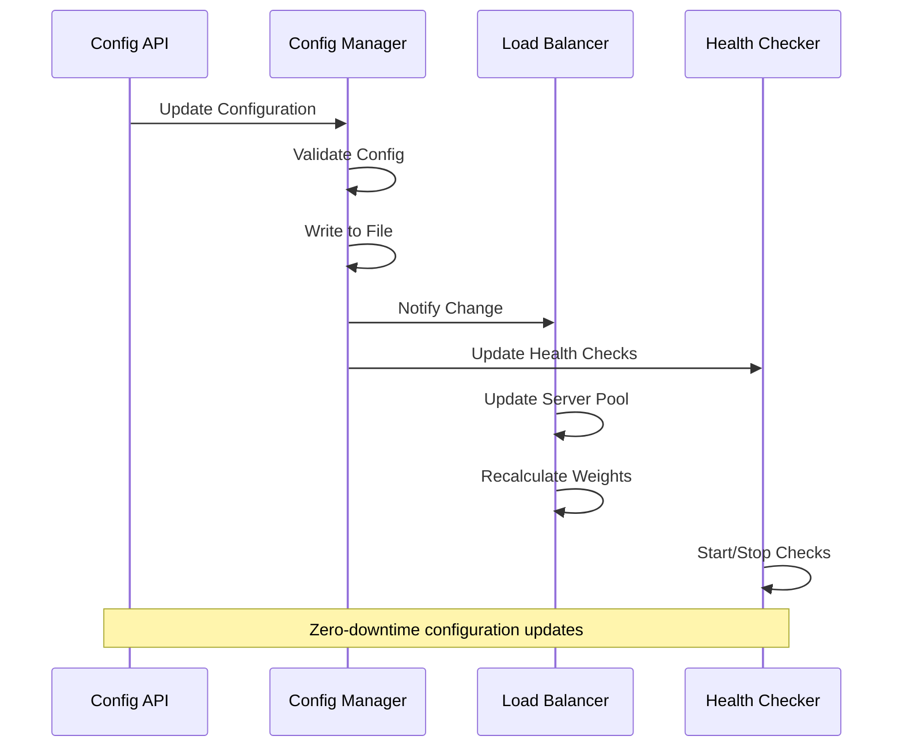
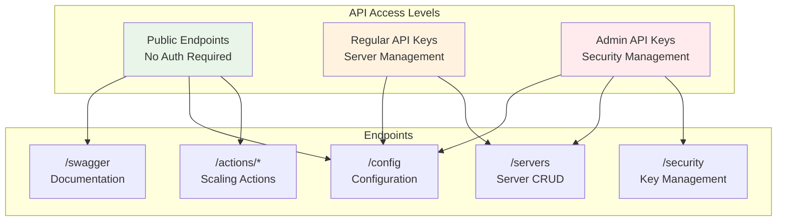
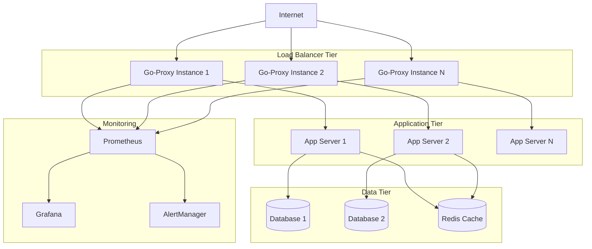
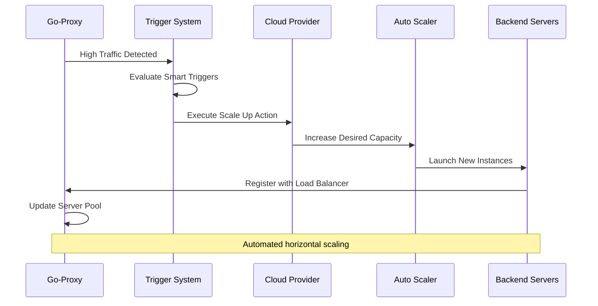
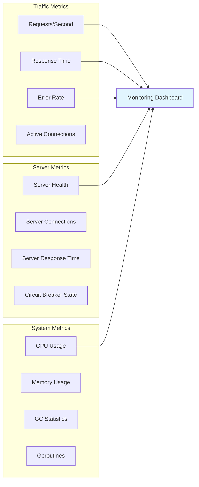

# Go-Proxy: Enterprise Load Balancer

[](https://golang.org/)
[](https://www.docker.com/)
[](http://localhost:8082/swagger)
[](LICENSE)

**Go-Proxy** is a high-performance, enterprise-grade HTTP load balancer built with Domain-Driven Design (DDD) architecture. It provides intelligent traffic distribution, real-time configuration management, and automated scaling capabilities.

## 🚀 Key Features

- **🔄 Dynamic Configuration**: Real-time config updates without restarts
- **🧠 Smart Load Balancing**: 6 advanced algorithms with adaptive selection
- **📊 Intelligent Triggers**: Traffic and schedule-based auto-scaling
- **🔐 Secure API**: Multi-level authentication with admin controls
- **📈 Enterprise Monitoring**: Comprehensive metrics and health checks
- **🐳 Cloud-Ready**: Docker support with multi-stage builds
- **⚡ High Performance**: Circuit breakers, connection pooling, health checks

## 📋 Table of Contents

- [Architecture Overview](#-architecture-overview)
- [Load Balancing Algorithms](#-load-balancing-algorithms)
- [Configuration Management](#-configuration-management)
- [API Documentation](#-api-documentation)
- [Deployment Guide](#-deployment-guide)
- [Cloud Integration](#-cloud-integration)
- [Monitoring & Observability](#-monitoring--observability)
- [Development](#-development)

## 🏗️ Architecture Overview

Go-Proxy follows Domain-Driven Design principles with clean architecture separation:



### System Components



## ⚖️ Load Balancing Algorithms

Go-Proxy implements 6 sophisticated load balancing algorithms with intelligent auto-selection:

### Algorithm Comparison

| Algorithm | Use Case | Pros | Cons |
|-----------|----------|------|------|
| **Adaptive Weighted** | General purpose | Self-optimizing, performance-aware | Higher CPU usage |
| **Least Connections** | Long-lived connections | Fair distribution | Connection counting overhead |
| **Response Time** | Latency-sensitive | Fastest response | Requires response time tracking |
| **Consistent Hash** | Session affinity | Sticky sessions, cache-friendly | Uneven distribution possible |
| **Power of Two** | High throughput | Low overhead, good distribution | Less precise than least connections |
| **Weighted Fair Queue** | Mixed workloads | QoS support, priority handling | Complex configuration |

### Algorithm Selection Flow



## 🔧 Configuration Management

### Configuration Structure

```yaml
# Core proxy settings
proxy:
  port: 8080

# Backend server pools
backends:
  - name: "web-servers"
    servers:
      - url: "http://backend1:3001"
        weight: 3
        max_connections: 100
        health_check_endpoint: "/health"
    balance_mode: "adaptive_weighted"
    min_servers: 1
    max_servers: 10
    health_interval: "10s"
    circuit_breaker:
      enabled: true
      failure_threshold: 5
      recovery_timeout: "30s"

# Intelligent triggers
triggers:
  smart:
    enabled: true
    evaluation_interval: "5s"
    scale_up_score: 0.45
    scale_down_score: 0.15
  
  traffic:
    high_threshold: 50
    low_threshold: 5
    high_action: "scale_up"
    low_action: "scale_down"
  
  schedule:
    - time: "09:00"
      action: "morning_scale"

# Scaling actions
actions:
  scale_up:
    url: "http://localhost:8082/actions/scale_up"
    method: "POST"

# Security configuration
security:
  api_keys:
    - "dev-key-456"
    - "prod-key-789"
  admin_api_keys:
    - "super-admin-key-999"
```

### Configuration Hot-Reload



## 📡 API Documentation

### Authentication Levels



### API Endpoints

| Endpoint | Method | Auth | Description |
|----------|--------|------|-------------|
| `/config` | GET | None | Get current configuration |
| `/config` | PUT | Regular | Update configuration |
| `/servers` | POST | Regular | Add backend server |
| `/servers` | PUT | Regular | Update server |
| `/servers` | DELETE | Regular | Remove server |
| `/security` | GET | Admin | View API keys |
| `/security` | PUT | Admin | Manage API keys |
| `/actions/scale_up` | POST | None | Scale up servers |
| `/actions/scale_down` | POST | None | Scale down servers |
| `/swagger` | GET | None | API documentation |

### Interactive Documentation

Access the full API documentation at: **http://localhost:8082/swagger**

## 🚀 Deployment Guide

### Quick Start

```bash
# Clone repository
git clone https://github.com/juanbautista0/go-proxy
cd go-proxy

# Local development
make run

# Docker deployment
make docker-compose-up

# Production build
make build
./bin/proxy
```

### Docker Deployment

#### Single Container
```bash
# Build optimized image (~15MB)
make docker-build

# Run with custom config
docker run -d \
  --name go-proxy \
  -p 8080:8080 -p 8081:8081 -p 8082:8082 \
  -v $(pwd)/config.yaml:/app/config.yaml:ro \
  go-proxy:latest
```

#### Docker Compose Stack
```bash
# Start complete stack (proxy + backends)
make docker-compose-up

# View logs
make docker-logs

# Scale backends
docker-compose up -d --scale backend1=3
```

### Production Deployment




### Webhook Integration Flow



## 📊 Monitoring & Observability

### Metrics Endpoints

| Endpoint | Description | Format |
|----------|-------------|---------|
| `/metrics` | Prometheus metrics | Text |
| `/health` | Health check | JSON |
| `/stats` | Real-time statistics | JSON |

### Key Metrics



### Prometheus Configuration

```yaml
# prometheus.yml
scrape_configs:
  - job_name: 'go-proxy'
    static_configs:
      - targets: ['localhost:8081']
    scrape_interval: 15s
    metrics_path: /metrics
```

### Grafana Dashboard

Key panels to monitor:
- Request rate and response time
- Error rate and success rate
- Server health status
- Load balancing distribution
- Circuit breaker states
- Auto-scaling events

## 🛠️ Development

### Project Structure

```
go-proxy/
├── cmd/                    # Application entry points
│   └── main.go
├── internal/
│   ├── domain/            # Business logic and entities
│   │   ├── config.go
│   │   └── proxy.go
│   ├── application/       # Application services
│   │   ├── proxy_service.go
│   │   ├── trigger_service.go
│   │   └── smart_trigger_service.go
│   └── infrastructure/    # External concerns
│       ├── enterprise_balancer.go
│       ├── config_manager.go
│       ├── health_checker.go
│       └── action_executor.go
├── config.yaml           # Configuration file
├── Dockerfile            # Multi-stage Docker build
├── docker-compose.yml    # Development stack
└── README.md            # This file
```

### Building from Source

```bash
# Install dependencies
go mod download

# Run tests
make test

# Run with coverage
make test-coverage

# Build binary
make build

# Run locally
make run
```

### Testing

```bash
# Unit tests
make test-unit

# Integration tests
make test-integration

# Benchmarks
make bench

# Coverage report
make test-coverage
open coverage.html
```

### Contributing

1. Fork the repository
2. Create a feature branch
3. Add tests for new functionality
4. Ensure all tests pass
5. Submit a pull request

## 📈 Performance Characteristics

### Benchmarks

| Metric | Value | Notes |
|--------|-------|-------|
| **Throughput** | 50K+ RPS | Single instance |
| **Latency P50** | < 1ms | Local backends |
| **Latency P99** | < 10ms | Local backends |
| **Memory Usage** | ~50MB | Baseline |
| **CPU Usage** | ~5% | At 10K RPS |
| **Connections** | 10K+ | Concurrent |

### Scaling Limits

- **Backends per pool**: 1,000+
- **Concurrent connections**: 100K+
- **Configuration size**: 10MB+
- **Health check frequency**: 1s minimum
- **Trigger evaluation**: 100ms minimum

## 🔒 Security Features

- **Multi-level API authentication**
- **Rate limiting and DDoS protection**
- **Secure configuration management**
- **Health check validation**
- **Circuit breaker protection**
- **Non-root Docker execution**
- **Minimal attack surface**

## 📄 License

This project is licensed under the MIT License - see the [LICENSE](LICENSE) file for details.

## 🤝 Support

- **Documentation**: [API Docs](http://localhost:8082/swagger)
- **Issues**: [GitHub Issues](https://github.com/juanbautista0/go-proxy/issues)
- **Discussions**: [GitHub Discussions](https://github.com/juanbautista0/go-proxy/discussions)

---

**Built with ❤️ using Go and modern cloud-native practices**